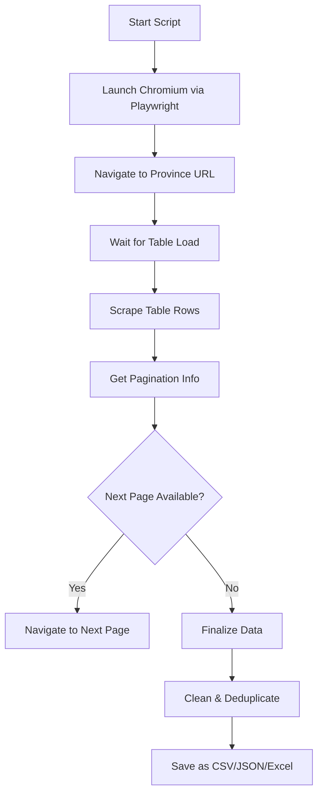

# 🏭 Kemenperin Company Directory Scraper


> A powerful and fully automated scraping tool that navigates the [Indonesian Ministry of Industry's](https://kemenperin.go.id/direktori-perusahaan) company directory using **Playwright**, extracts data via **BeautifulSoup**, and processes it with **pandas**. Export your data as CSV, JSON, or Excel — with zero manual effort.

---

## 📦 Features

✅ Headless browser automation 
✅ Smart pagination and navigation handling  
✅ Robust HTML parsing 
✅ Intelligent row reconstruction from semi-structured HTML  
✅ Cleans, deduplicates, and exports to `.csv`, `.json`, and `.xlsx`  
✅ Logging & error handling with timestamped feedback

---

## 📊 Architecture Overview



---

## 🧠 Technologies Used

| Tech | Description |
|------|-------------|
| `playwright.async_api` | Automates browsing and dynamic content |
| `BeautifulSoup4` | Parses HTML and reconstructs structured data |
| `pandas` | DataFrame manipulation, deduplication, and export |
| `logging` | Structured logs for progress and errors |
| `asyncio` | Efficient concurrency with non-blocking I/O |

---

## 📍 Targeted Provinces (Default URLs)
You can switch which region to scrape by modifying the `base_url`:
```python
# Examples from main.py:
base_url = "https://kemenperin.go.id/direktori-perusahaan?what=&prov=JQYaw_F3IWxjLT5vFsXUh6CwfCBsw3zUdgJGGaNtqc0%2C"  # Jawa Tengah
```

---

## 🚀 How to Run

### 🐍 1. Set up environment

```bash
python -m venv venv
source venv/bin/activate  # or venv\Scripts\activate on Windows
pip install -r requirements.txt
```

> Sample `requirements.txt`:
```txt
playwright
beautifulsoup4
pandas
openpyxl
```

---

### 🌐 2. Install browser drivers

```bash
playwright install
```

---

### ▶️ 3. Run the script

```bash
python main.py
```

---

## 📂 Output Formats

| Format | File Example |
|--------|--------------|
| `.csv` | `kemenperin_companies_20250801_134530.csv` |
| `.json` | `kemenperin_companies_20250801_134530.json` |
| `.xlsx` | `kemenperin_companies_20250801_134530.xlsx` |

---

## 📈 Data Fields (Auto Inferred)

Since the source HTML uses inconsistent `br`-based formatting, this scraper **intelligently reconstructs rows** into:
- ID / No.
- Company Name
- KBLI Code
- Address
- Phone Number
- Others (optional fields)

The output column names are generic (`Column_1`, `Column_2`, etc.) and can be mapped in post-processing.

---

## 🧪 Sample Analysis (Console Output)

```bash
2025-08-01 13:45:30 - INFO - Total records: 678
2025-08-01 13:45:30 - INFO - Columns: Column_1, Column_2, Column_3, ...
2025-08-01 13:45:30 - INFO - Removed 18 duplicate rows
2025-08-01 13:45:30 - INFO - Data saved to kemenperin_companies_20250801_134530.xlsx
```

---

## ⚠️ Notes

- Set `"headless=False"` in `playwright.chromium.launch()` if you want to visually debug the process.
- The script uses a **safety loop limit** (`200,000`) to avoid infinite scraping loops.
- Be mindful of the target site's load — the script includes polite `sleep()` calls.

---

## 🙋‍♂️ Questions or Help?

Open an [Issue](https://github.com/your-repo/issues) or email me at **iqbalputeh75@gmail.com**
